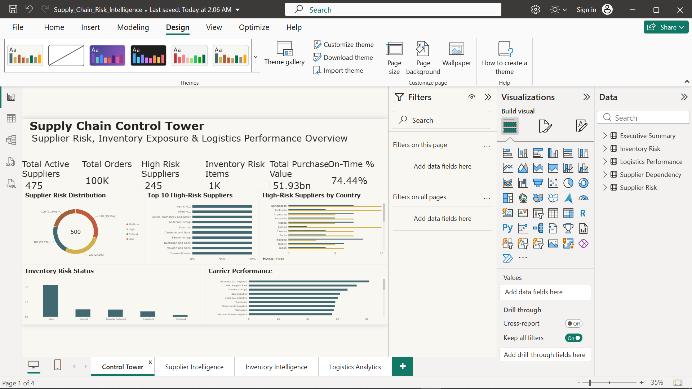
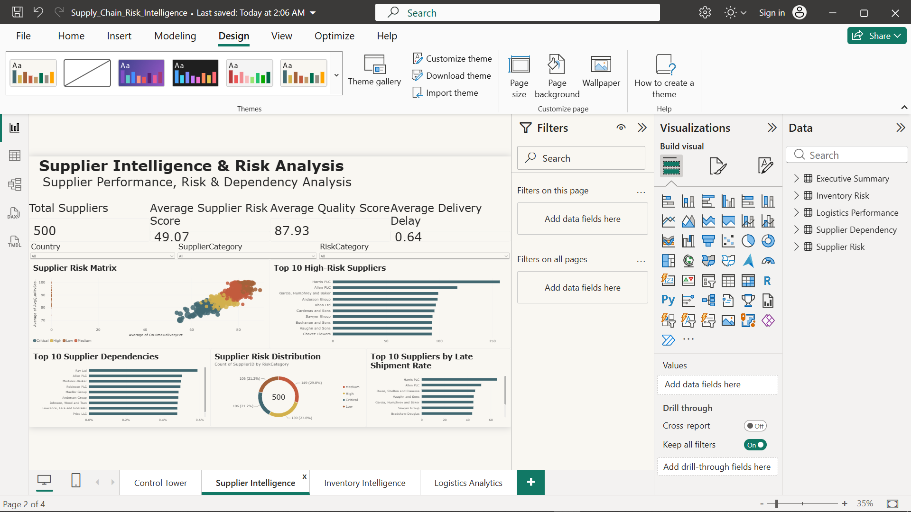
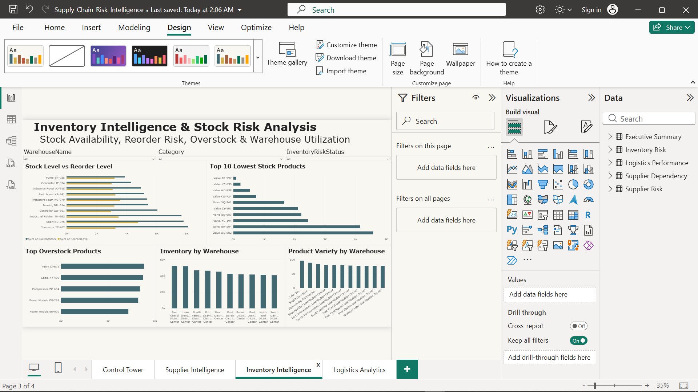
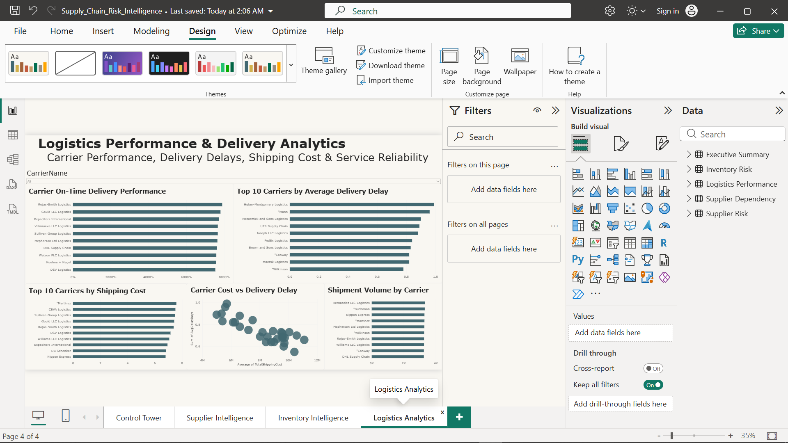

# 🚢 Supply Chain Risk Intelligence Platform

### SQL Server Data Warehouse + Power BI + Risk Analytics

An enterprise-style supply chain analytics project designed to identify supplier risk, inventory shortages, logistics delays, purchasing dependency, and operational performance using **SQL Server, SQL analytics, DAX, and Power BI**.

This project goes beyond a basic dashboard by demonstrating a complete analytics workflow from **data generation and database design to risk analysis and business intelligence reporting**.

---

## 📌 Project Overview

Modern supply chains face several operational risks, including:

- Supplier delivery delays
- Poor supplier quality
- Overdependence on individual suppliers
- Inventory shortages
- Overstocking
- High logistics costs
- Poor carrier performance

The goal of this project is to transform large-scale supply chain data into actionable business insights.

The solution provides management with a centralized view of supplier performance, inventory conditions, purchasing exposure, and logistics performance.

---

## 🎯 Business Objectives

The project was developed to answer questions such as:

- Which suppliers present the highest business risk?
- Which suppliers are responsible for frequent delivery delays?
- How dependent is the company on individual suppliers?
- Which products are at risk of stockout?
- Which products are overstocked?
- Which warehouses hold the most inventory?
- Which logistics carriers are the most reliable?
- Which carriers generate the highest shipping costs?
- Where should management focus risk-reduction efforts?

---

## 📥 Data Collection & Generation

The dataset used in this project is **synthetic supply chain data created specifically for analytical and portfolio purposes**.

No confidential or proprietary company data was used.

The data was designed to simulate a realistic enterprise supply chain environment containing suppliers, products, warehouses, purchase orders, shipments, and inventory records.

### Synthetic Dataset Size

| Dataset | Records |
|---|---:|
| Suppliers | 500 |
| Products | 1,000 |
| Warehouses | 50 |
| Orders | 100,000 |
| Shipments | 100,000 |
| Inventory Records | 200,000 |

### Data Generation Approach

The synthetic dataset was generated using realistic business rules and relationships between the main supply chain entities.

Examples include:

- Each purchase order is associated with a supplier, product, and warehouse.
- Shipment records are linked to corresponding purchase orders.
- Order quantities and unit costs are used to calculate purchase values.
- Expected and actual delivery performance are used to calculate shipment delays.
- Supplier quality scores are generated within realistic performance ranges.
- Shipping costs vary across carriers and shipments.
- Inventory quantities are generated in relation to product reorder levels.
- Supplier purchasing dependency is calculated based on each supplier's share of total purchasing value.
- Inventory risk is evaluated using current stock and reorder requirements.

The generated data was then loaded into **SQL Server**, where it was structured, transformed, and prepared for analytical reporting.

### Why Synthetic Data?

Real enterprise supply chain datasets often contain sensitive information such as:

- Supplier contracts
- Procurement costs
- Inventory values
- Purchasing agreements
- Logistics costs
- Supplier performance information

Because this information is generally confidential, synthetic data was used to demonstrate the complete analytics process without exposing real business data.

### End-to-End Data Flow

```text
Synthetic Data Generation
        ↓
SQL Server Database
        ↓
Data Warehouse Modeling
        ↓
SQL Analytical Views
        ↓
Risk & Performance Calculations
        ↓
Power BI Data Model
        ↓
DAX Measures
        ↓
Interactive Dashboards
        ↓
Business Insights
```

---

## 🛠️ Tools & Technologies

- SQL Server
- SQL Server Management Studio
- Power BI
- DAX
- SQL Views
- Common Table Expressions
- Window Functions
- Stored Procedures
- Data Warehouse Modeling
- Business Intelligence
- Risk Analytics
- Data Visualization

---

# 🏗️ Data Architecture

The project follows a structured data warehouse approach.

The analytical model contains the following major business entities:

```text
Suppliers
Products
Warehouses
Orders
Shipments
Inventory
```

These datasets are connected through supplier, product, warehouse, order, and shipment relationships to support integrated supply chain analysis.

### Main Data Areas

**Supplier Data**
- Supplier information
- Quality performance
- Purchasing activity
- Risk exposure

**Product Data**
- Product information
- Unit costs
- Inventory requirements
- Purchasing activity

**Warehouse Data**
- Warehouse locations
- Inventory distribution
- Product availability

**Order Data**
- Purchase quantities
- Unit costs
- Order values
- Supplier relationships

**Shipment Data**
- Carrier information
- Delivery performance
- Shipment delays
- Shipping costs

**Inventory Data**
- Current stock
- Reorder level
- Warehouse inventory
- Stock availability

---

# 📊 SQL Analytics Layer

Several analytical views were created to transform raw operational data into business-ready information for Power BI.

---

## 1. Supplier Risk Analysis

### `vw_supplier_risk_analysis`

Key metrics include:

- Average delivery delay
- Late shipment percentage
- Supplier quality score
- Total purchase value
- Supplier dependency
- Risk score
- Risk category

This view helps identify suppliers that create the greatest operational and financial exposure.

---

## 2. Supplier Dependency Analysis

### `vw_supplier_dependency`

This analysis measures how heavily the company depends on individual suppliers.

It helps answer:

> What would happen if an important supplier became unavailable?

Supplier dependency is calculated based on the supplier's share of total purchasing value.

High purchasing dependency combined with poor supplier performance represents a significant supply chain risk.

---

## 3. Inventory Risk Analysis

### `vw_inventory_risk`

Key metrics include:

- Current stock
- Reorder level
- Stock availability
- Inventory risk
- Overstock indicators
- Warehouse-level inventory

The analysis helps identify products with insufficient or excessive stock.

---

## 4. Logistics Performance Analysis

### `vw_logistics_performance`

Key logistics metrics include:

- Carrier performance
- Delivery delay
- Shipping cost
- On-time delivery performance
- Carrier reliability

This analysis helps management identify logistics providers that are expensive, slow, or unreliable.

---

# 🧠 Advanced SQL Techniques

The project demonstrates several SQL techniques commonly used in business intelligence and analytics projects.

## Common Table Expressions

CTEs were used to organize complex calculations and analytical logic.

```sql
WITH SupplierMetrics AS
(
    SELECT
        Supplier_ID,
        AVG(Delay_Days) AS AvgDelay,
        AVG(QualityScore) AS Quality
    FROM Fact_Shipments
    GROUP BY Supplier_ID
)

SELECT *
FROM SupplierMetrics;
```

---

## Window Functions

Window functions were used for ranking and comparative analysis.

```sql
RANK()
OVER(
    ORDER BY TotalSpend DESC
)
```

Applications include:

- Supplier ranking
- Purchase dependency analysis
- Risk prioritization
- Performance comparison

---

## Stored Procedures

Stored procedures were designed to support reusable reporting logic.

Example:

```sql
sp_GetSupplierRiskReport
```

Example input:

```sql
@RiskLevel = 'High'
```

The procedure can return suppliers based on selected risk categories.

---

## Analytical Views

Power BI connects to analytical SQL views rather than relying only on raw transactional tables.

This helps keep business logic organized and makes the reporting layer easier to maintain.

---

# 📈 Power BI Dashboards

The final Power BI report contains four major analytical dashboards.

---

# 1️⃣ Supply Chain Control Tower

The **Supply Chain Control Tower** provides an executive overview of overall supply chain performance and risk.

### KPI Cards

- Total Suppliers
- Total Orders
- High-Risk Suppliers
- On-Time Delivery %
- Inventory Risk Items
- Total Purchase Value

### Key Visuals

- Supplier risk overview
- Delivery performance
- Supplier risk distribution
- Purchasing exposure
- Overall supply chain performance indicators

### Business Purpose

This dashboard allows management to quickly understand the overall health of the supply chain and identify areas requiring further investigation.

---

# 2️⃣ Supplier Intelligence

The **Supplier Intelligence** dashboard focuses on supplier risk, quality, delivery performance, and purchasing dependency.

### KPI Cards

- Total Suppliers
- High-Risk Suppliers
- Average Supplier Risk Score
- Average Quality Score
- Average Delivery Delay

### Visuals

- Supplier Risk Matrix
- Top 10 High-Risk Suppliers
- Supplier Dependency Analysis
- Supplier Risk Distribution
- Top Suppliers by Late Shipment Rate
- Supplier Risk Detail Table

### Key Analytical Areas

Supplier performance is evaluated using:

- Delivery delays
- Quality score
- Late shipment rate
- Purchase dependency
- Total purchase value
- Overall risk score

### Business Purpose

This dashboard helps management identify suppliers that require closer monitoring, corrective action, or alternative sourcing strategies.

---

# 3️⃣ Inventory Intelligence

The **Inventory Intelligence** dashboard focuses on inventory availability, reorder requirements, overstock, and warehouse-level stock analysis.

### KPI Cards

- Total Inventory Units
- Critical Stock Items
- Low Stock Items
- Overstock Items
- Total Inventory Value

### Visuals

- Stock Level vs Reorder Level
- Top 10 Lowest Stock Products
- Top 10 Overstock Products
- Inventory by Warehouse
- Product Variety by Warehouse

### Inventory Risk Logic

Inventory can be categorized based on stock availability relative to reorder requirements.

Possible categories include:

```text
Critical
Low
Safe
Overstock
```

### Business Purpose

This dashboard helps reduce the risk of stockouts while also identifying excess inventory that may unnecessarily tie up working capital.

---

# 4️⃣ Logistics Analytics

The **Logistics Analytics** dashboard evaluates transportation cost, carrier performance, and delivery reliability.

### KPI Cards

- Total Shipments
- On-Time Delivery %
- Average Delivery Delay
- Total Shipping Cost
- Average Shipping Cost

### Visuals

- Carrier On-Time Delivery Performance
- Top Carriers by Average Delivery Delay
- Shipping Cost by Carrier
- Carrier Cost vs Delivery Delay
- Shipment Volume by Carrier
- Carrier Performance Detail Table

### Business Purpose

This dashboard helps identify carriers that are:

- Expensive
- Frequently delayed
- Operationally inefficient
- Highly reliable
- Handling significant shipment volume

---

# 📊 Important DAX Measures

Several DAX measures were created to support interactive Power BI analysis.

## Total Purchase Value

```DAX
Total Purchase Value =
SUM(FactOrders[OrderValue])
```

---

## Supplier Dependency Percentage

```DAX
Dependency_Percentage =
DIVIDE(
    SUM('Supplier Dependency'[TotalPurchaseValue]),
    CALCULATE(
        SUM('Supplier Dependency'[TotalPurchaseValue]),
        ALL('Supplier Dependency'[SupplierName])
    ),
    0
)
```

This calculates each supplier's share of total purchasing value.

---

## Overstock Ratio

```DAX
Overstock Ratio =
DIVIDE(
    SUM('Inventory Risk'[CurrentStock]),
    SUM('Inventory Risk'[ReorderLevel]),
    0
)
```

This measure helps identify products with unusually high stock levels relative to their reorder requirements.

---

# 🔎 Key Business Insights

The analytical model enables management to identify situations such as:

- Suppliers with high purchasing dependency and poor delivery performance
- High-risk suppliers requiring alternative sourcing strategies
- Suppliers with frequent late shipments
- Products approaching stockout levels
- Products holding excessive inventory
- Warehouses with unusually high inventory concentration
- Carriers with poor delivery reliability
- Logistics providers generating high shipping costs
- Areas where working capital is unnecessarily tied up in inventory

---

# 💼 Business Value

The platform supports several areas of supply chain decision-making.

## Supplier Management

Identify unreliable or high-risk suppliers and support supplier diversification decisions.

## Inventory Planning

Reduce stockout risk while minimizing unnecessary overstock.

## Logistics Optimization

Compare carrier cost and delivery performance to identify efficient transportation providers.

## Risk Management

Prioritize supply chain risks based on operational and financial impact.

## Procurement Strategy

Understand supplier purchasing dependency and supplier concentration.

## Management Reporting

Provide decision-makers with a centralized view of supply chain performance.

---

# 🎨 Dashboard Design

The Power BI report follows a consistent enterprise-style design.

### Design Features

- Page navigation
- KPI cards
- Interactive slicers
- Risk-based conditional formatting
- Consistent visual formatting
- Management-focused charts
- Detailed analytical tables
- Consistent supplier and inventory risk colors

### Report Pages

```text
Supply Chain Control Tower
Supplier Intelligence
Inventory Intelligence
Logistics Analytics
```

---

# 📷 Dashboard Screenshots

## Supply Chain Control Tower



---

## Supplier Intelligence



---

## Inventory Intelligence



---

## Logistics Analytics



---

# 📂 Repository Structure

```text
Supply-Chain-Risk-Intelligence/
│
├── SQL/
│   ├── database_creation.sql
│   ├── tables.sql
│   ├── data_generation.sql
│   ├── data_loading.sql
│   ├── supplier_risk_analysis.sql
│   ├── supplier_dependency.sql
│   ├── inventory_risk.sql
│   ├── logistics_performance.sql
│   └── stored_procedures.sql
│
├── PowerBI/
│   └── Supply_Chain_Risk_Intelligence.pbix
│
├── Screenshots/
│   ├── control-tower.png
│   ├── supplier-intelligence.png
│   ├── inventory-intelligence.png
│   └── logistics-analytics.png
│
|
│
└── README.md
```

---

# 🚀 Skills Demonstrated

This project demonstrates practical experience in:

- SQL Server
- SQL Server Management Studio
- Data warehouse design
- Data modeling
- Synthetic data generation
- Large dataset analysis
- Data transformation
- Advanced SQL queries
- CTEs
- Window functions
- Analytical views
- Stored procedures
- DAX
- Power BI
- Dashboard development
- Data visualization
- Supplier risk analytics
- Inventory analytics
- Logistics analytics
- Procurement analysis
- Business intelligence
- Data-driven decision making

---

# 🔄 Project Workflow

```text
Business Requirements
        ↓
Database Design
        ↓
Synthetic Data Generation
        ↓
Data Loading into SQL Server
        ↓
Data Validation
        ↓
SQL Analytical Layer
        ↓
Risk Calculations
        ↓
Power BI Data Modeling
        ↓
DAX Measures
        ↓
Dashboard Development
        ↓
Business Insights
```

---

# 📌 Project Outcome

The final solution provides a complete **Supply Chain Risk Intelligence Platform** where business users can monitor:

- Supplier performance
- Supplier dependency
- Purchasing exposure
- Inventory availability
- Stock risk
- Warehouse inventory
- Logistics costs
- Carrier performance
- Delivery reliability
- Overall operational risk

The project demonstrates how large-scale synthetic operational data can be transformed into meaningful business intelligence using **SQL Server, data warehouse modeling, SQL analytics, DAX, and Power BI**.

---

## ⚠️ Disclaimer

This project was developed for **portfolio and educational purposes**.

All business data used in the project is synthetic and does not represent any real company, supplier, customer, warehouse, or commercial transaction.